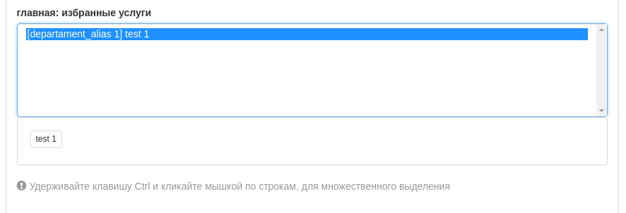

# yii2 Multiple Selector Widget for Lists

## Установка / Install

`composer require lg-xenos/yii2-multiple-selector`

**`backend/view/test/test.php`**
```php
echo  $form
        ->field($model, 'main_image')
        ->widget(\lgxenos\yii2\imgSelector\ImageSelector::className());
        ->widget(\lgxenos\yii2\multipleSelector\MultipleSelector::className(), ['items' => SomeModel::getDropdownArray(), 'multiple' => 1]);
```



